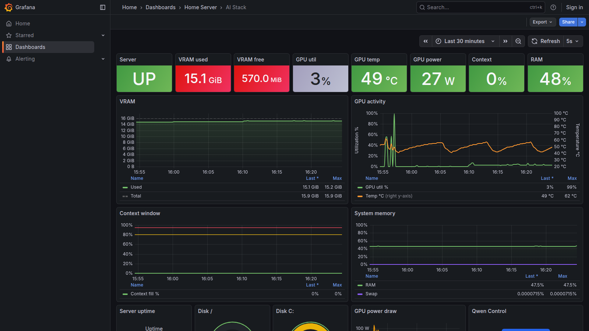

# AI Stack Home Server Dashboard

Local Prometheus + Grafana monitoring for the WSL qwen/llama-server stack.



## What it shows

**Status bar (top):** 8 always-visible stats: server state (UP / LOADING / DOWN), VRAM used, VRAM free, GPU utilization, GPU temperature, GPU power draw, context window fill, system RAM.

**Graphs:**
- **VRAM:** used bytes vs. total (reference line), auto-scales to GB
- **GPU activity:** utilization % on left axis, temperature on right axis (dual scale, no overlap)
- **Context window:** context fill % over time, shows session start/end and context resets
- **System memory:** RAM % and swap % on a shared 0-100% axis

**Bottom row:** server uptime, disk gauges for `/` and `C:`, GPU power sparkline, control panel button.

## Stack

- `qwen_exporter.py` on `127.0.0.1:9108` -- scrapes nvidia-smi, /proc, llama-server /health and /slots
- `qwen_control.py` on `127.0.0.1:9110` -- start/stop/restart UI
- Prometheus on `127.0.0.1:9090` -- 5s scrape interval, 15d retention
- Grafana on `127.0.0.1:3000` -- auto-provisioned dashboard, anonymous viewer access

The exporter is read-only. It does not export prompts, responses, API keys, or request bodies.

## Setup

```bash
mkdir -p ~/.config/systemd/user
cp systemd/qwen-dashboard.service ~/.config/systemd/user/
cp systemd/qwen-exporter.service ~/.config/systemd/user/
cp systemd/qwen-control.service ~/.config/systemd/user/
systemctl --user daemon-reload
systemctl --user enable --now qwen-dashboard qwen-exporter qwen-control
```

Start inference:

```bash
qwenctl restart
```

URLs:

| Service | URL |
|---|---|
| Grafana dashboard | http://127.0.0.1:3000/d/qwen-stack |
| Control UI | http://127.0.0.1:9110 |
| Prometheus | http://127.0.0.1:9090 |
| Exporter metrics | http://127.0.0.1:9108/metrics |

Grafana login: `admin` / `admin`. Anonymous viewer access enabled on localhost.

## Validation

```bash
uv run python -m py_compile exporter/qwen_exporter.py control/qwen_control.py
uv run python exporter/qwen_exporter.py --port 19108
uv run python control/qwen_control.py --port 19110
docker compose config
```
